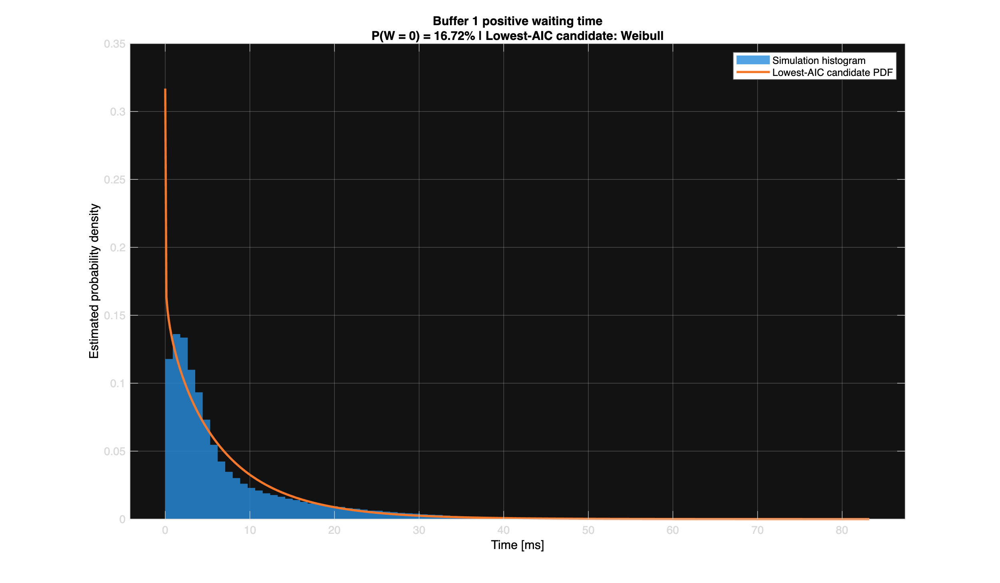
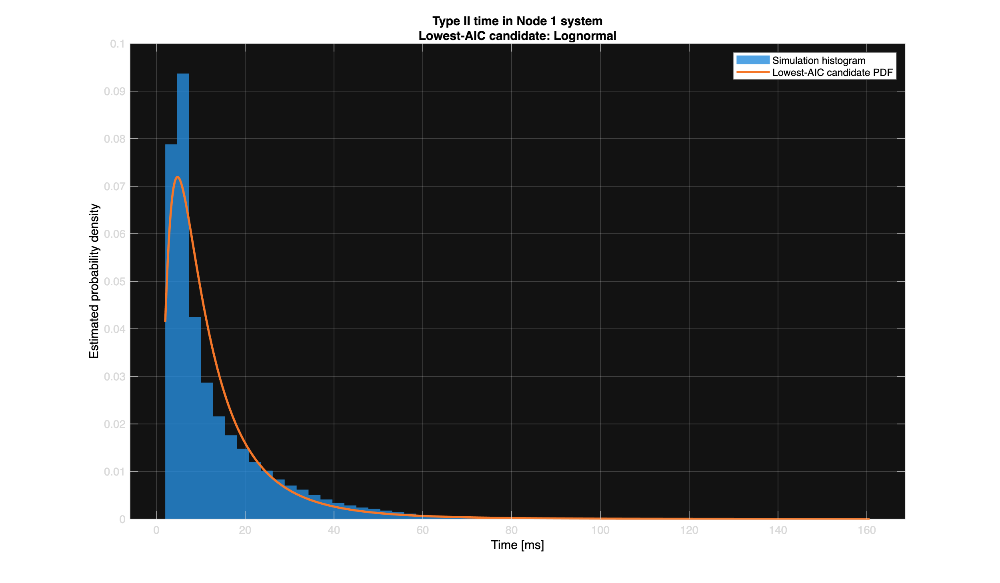
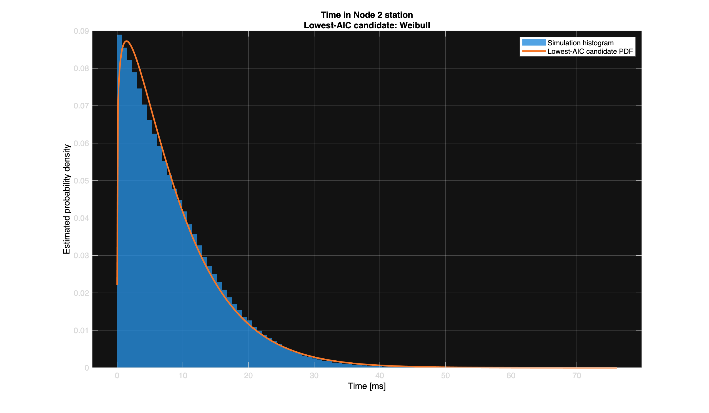

# Packet Processing Discrete-Event Simulation

A MATLAB discrete-event simulation of a two-stage packet-processing system with stochastic arrivals, queueing, alternating service windows, probabilistic routing, parallel processors, congestion-based redirection, and statistical performance analysis.

## Overview

The model simulates two packet classes entering separate buffers at the first processing node.

A single non-preemptive processor serves the two buffers according to a repeating scheduling cycle:

- Buffer 1 receives a 50 ms service window.
- Buffer 2 receives a 30 ms service window.
- If only one buffer contains packets, the available packet can be served immediately.
- Service already in progress is not interrupted when the scheduled buffer changes.

After Node 1, packets may be routed to a second processing station containing a shared queue and two parallel processors.

The simulation is event-driven: the clock advances directly to the next arrival, service completion, or scheduling event rather than using fixed time steps.

## System Model

### Packet Arrivals

Type I packets:

- Poisson arrival process
- Mean interarrival time: 4 ms
- Uniform service time at Node 1: 1–3 ms

Type II packets:

- Poisson arrival process
- Mean interarrival time: 12 ms
- Uniform service time at Node 1: 2–6 ms

### Node 2

Node 2 contains:

- One shared waiting queue
- Two parallel processors
- Exponentially distributed service times
- Mean service time: 5 ms

If the Node 2 waiting queue contains more than five packets, an arriving packet is redirected instead of entering the station.

## Simulation Method

The model uses discrete-event simulation with events including:

- Type I packet arrivals
- Type II packet arrivals
- Node 1 service completions
- Node 1 scheduling-window changes
- Node 2 service completions

The simulator tracks queue states, processor states, future event times, waiting times, system times, and routing decisions.

A warm-up period is excluded from measurements to reduce initialization bias.

## Statistical Analysis

The default experiment uses:

- 20 independent replications
- 1,500,000 ms simulation time per replication
- 150,000 ms warm-up period
- 95% Student's t confidence intervals

A separate longer simulation is used to generate packet-level samples for distribution analysis.

## Key Results

| Metric | Mean | 95% Confidence Interval |
|---|---:|---:|
| Type I packets at Node 1 | 2.0287 | [2.0213, 2.0362] |
| Type II packets at Node 1 | 1.1468 | [1.1399, 1.1538] |
| Type I queue length | 1.5286 | [1.5214, 1.5358] |
| Type II queue length | 0.8138 | [0.8069, 0.8206] |
| Buffer 1 waiting time | 6.1135 ms | [6.0865, 6.1404] ms |
| Buffer 2 waiting time | 9.7730 ms | [9.6922, 9.8539] ms |
| Type I Node 1 time | 8.1136 ms | [8.0863, 8.1408] ms |
| Type II Node 1 time | 13.7732 ms | [13.6924, 13.8540] ms |
| Node 2 station time | 8.5226 ms | [8.5093, 8.5358] ms |
| Router redirection probability | 1.9746% | [1.9479%, 2.0013%] |

Type II packets experience greater waiting time and total delay at Node 1 despite their lower arrival rate. This is consistent with their longer service times and shorter scheduled service window.

Node 2 experiences comparatively lower congestion because two processors operate in parallel.

## Distribution Analysis

A longer simulation run is used to compare packet-level timing data against several continuous probability distributions:

- Exponential
- Gamma
- Weibull
- Lognormal
- Normal

The candidate with the lowest Akaike Information Criterion (AIC) is recorded.

| Measurement | Lowest-AIC Candidate |
|---|---|
| Buffer 1 positive waiting time | Weibull |
| Buffer 2 positive waiting time | Weibull |
| Type I Node 1 time | Lognormal |
| Type II Node 1 time | Lognormal |
| Node 2 station time | Weibull |

Waiting-time data contains a probability mass at zero because some packets begin service immediately. Zero waiting times are therefore reported separately and continuous distributions are fitted only to positive waiting-time observations.

## Simulation Figures

### Buffer 1 Positive Waiting Time



### Type II Time Through Node 1



### Node 2 Station Time



Additional figures are available in the [`figures`](figures) directory.

## Repository Structure

```text
packet-processing-discrete-event-simulation/
├── README.md
├── src/
│   └── packet_processing_simulation.m
├── docs/
│   └── technical_summary.md
├── figures/
│   ├── hist_wait_buffer1.png
│   ├── hist_wait_buffer2.png
│   ├── hist_type1_node1.png
│   ├── hist_type2_node1.png
│   └── hist_node2_station.png
└── results/
    ├── ci_summary.csv
    └── distribution_fits.csv
```

## Running the Simulation

MATLAB with the Statistics and Machine Learning Toolbox is required.

Clone the repository or download the source file, then run:

```matlab
packet_processing_simulation
```

The program performs the independent replications, calculates confidence intervals, runs the longer distribution-analysis simulation, and generates CSV summaries and histogram figures.

## Engineering Concepts Demonstrated

- Discrete-event simulation
- Queueing systems
- Stochastic processes
- Event scheduling
- Monte Carlo simulation
- Parallel server modeling
- Statistical confidence intervals
- Warm-up period handling
- Probability distribution fitting
- MATLAB data analysis and visualization

## Technical Documentation

A more detailed explanation of the simulation architecture, scheduling rules, queue implementation, statistical measurement approach, and distribution analysis is available in:

[`docs/technical_summary.md`](docs/technical_summary.md)
